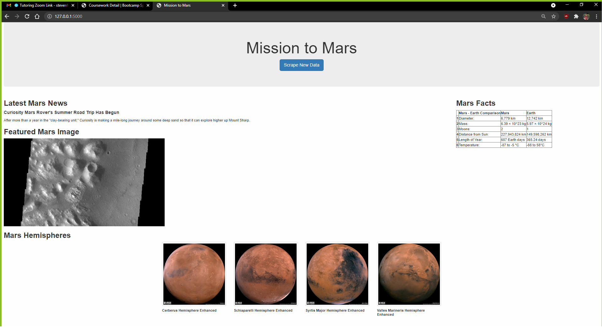

# Web-Scraping-Challenge
The Web-Scrapping-Challenge is a project to build a web application for data related to the Mission to Mars and display the information in a single HTML page. 
## Mars Data Scraped
* Latest Mars News
* Featured Mars Image
* Mars Facts: Diameter, Mass, Moons, Distance from Sun, Length of Year, and Temperature
* Mars Hemispheres
## Where to Find Mars Web Application Code
The Mars web application code can be found in the *Mission_to_Mars Folder*. The files in the folder are:
* *app.py*
* *mission_to_mars.ipynb*
* *scrape_mars.py*
* *templates folder* > *index.html*
## Where to Find Mars Web Application Visualizations
The Mars web application visualizations can be found in the *Visualization Folder*. The images are of the final web application:
* *Mission_to_Mars_app1.png*
* *Mission_to_Mars_app2.png*
## How to Use 
1. Download files from repository 
2. Open the *app.py* in Visual Studio or run through command prompt

